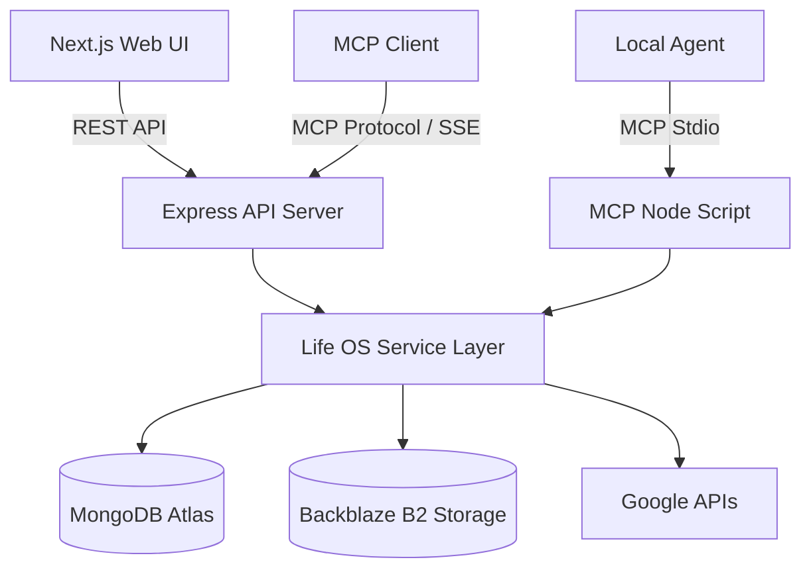

# Life OS


**Life OS** is a comprehensive, production-grade personal operating system and "second brain." It brings productivity, life tracking, knowledge management, and AI interoperability into a single, cohesive, self-hostable platform.

Built with security and scalability in mind, Life OS allows individuals or small groups to consolidate their digital lives into a private ecosystem, while seamlessly exposing their context to modern AI agents.

---

## 🚀 Key Features

### Complete Personal Ecosystem
Consolidate dozens of tracking apps into one unified dashboard.
- **Productivity**: Hierarchical Tasks, Goals, Kanban Projects, and Daily Habit tracking.
- **Health & Wellness**: Gym Workouts, Diet & Meals, Sleep Logs, Body Metric Tracking, and Google Fitness Integration.
- **Knowledge Base**: Rich Text Notes, Spaced-Repetition Flashcards, Visual Whiteboards, and Web Bookmarking.
- **Capture & Storage**: Quick idea Captures, Wishlists, and a secure File Vault powered by Backblaze B2.

### Host Control Center & Security
Designed for secure, multi-user self-hosting for family, friends, or a small team.
- **Registration Controls**: Toggle open registration, require admin approval (`REQUIRE_ACCOUNT_APPROVAL`), and set instance-wide user limits (`MAX_USERS`).
- **Storage Quotas**: Enforce maximum storage limits per user (`MAX_VAULT_BYTES_PER_USER`).
- **Role-Based Access**: Dedicated Admin dashboard to approve pending accounts, disable malicious users, and monitor instance health.
- **Audit Logging**: Comprehensive security audit trail for user and token lifecycle events.
- **Authentication**: JWT sessions, Bcrypt password hashing, and Multi-Factor Authentication (TOTP + Recovery Codes).

### Native AI Integration (Model Context Protocol)
Life OS is natively **MCP-enabled**, turning your personal data into rich context for AI agents like Claude Desktop, OpenClaw, or Cursor.
- **Dual Transport Support**: Connect locally via CLI Stdio (`npx tsx backend/src/mcp/index.ts`) or remotely via Server-Sent Events (SSE) over HTTP (`/api/mcp/sse`).
- **Dedicated MCP Tokens**: Generate, manage, and instantly revoke dedicated access tokens for your AI agents directly from the UI.
- **Safe Execution**: MCP tools route through the same authorized, user-isolated business logic as the Web UI. Agents cannot bypass database constraints or access other users' data.

---

## 🏗 Architecture

Life OS uses a modern, decoupled client-server architecture. The shared service layer gracefully handles both REST UI requests and MCP tool executions.



### Technology Stack

**Frontend**
- Next.js 15 (App Router)
- React 19 + TypeScript
- Zustand (Global State Management)
- Tailwind CSS + Framer Motion (Fluid UI & Micro-animations)

**Backend**
- Node.js 22 + Express + TypeScript
- MongoDB + Mongoose (Schema validation & aggregation)
- Model Context Protocol (MCP) SDK (@modelcontextprotocol/sdk)

**Storage & Integrations**
- MongoDB Atlas (Primary Database)
- Backblaze B2 (Vault File Storage)
- Google APIs (OAuth, Calendar Sync, Drive Backups, Fitness Sync)

---

## 🔒 Security Architecture

Life OS implements industry-standard security practices to protect personal data:

- **Authentication**: Stateless JWT-based session handling.
- **MFA / 2FA**: Time-based One-Time Passwords (TOTP) utilizing RFC 6238, plus one-time recovery codes.
- **Password Security**: Strong Bcrypt hashing.
- **Protection**: Express rate limiting, Helmet security headers, strict CORS policies, and request payload validation.
- **Data Isolation**: Strict user-level authorization checks at the repository layer. Even if an endpoint is compromised, data bleed is prevented by mandatory `userId` query scoping.
- **Private Zone**: Secondary authentication layer for highly sensitive Vault files.

---

## 🐳 Docker & Deployment

The backend is fully containerized for production environments.

- **Multi-stage Dockerfile**: Optimizes build size using Alpine Linux.
- **Security**: Runs as a non-root `lifeos` user.
- **Port**: Exposes `4000` natively.
- **Health Checks**: Provides a dedicated `/api/health` endpoint used by deployment scripts to verify successful rollouts.

### Deployment Flow
1. Code is pushed to the `main` branch.
2. GitHub Actions builds the Docker image and publishes it to GHCR (`ghcr.io`).
3. The Action connects to the target VPS via SSH, pulls the latest image, removes the old container, and starts the new one using the server's `.env` file.
4. A curl-based polling health check ensures the container is ready before reporting success.

---

## ⚙️ Environment Configuration

### Backend (`backend/.env`)

**Core Setup:**
- `PORT=4000`
- `MONGODB_URI=mongodb+srv://...`
- `JWT_SECRET=your_super_secret_string`
- `FRONTEND_URL=http://localhost:3000`

**Host Control & Limits:**
- `REGISTRATION_ENABLED=true`
- `REQUIRE_ACCOUNT_APPROVAL=true`
- `MAX_USERS=10`
- `MAX_VAULT_BYTES_PER_USER=1073741824` (1GB in bytes)

**Integrations:**
- `GOOGLE_CLIENT_ID` / `GOOGLE_CLIENT_SECRET` / `GOOGLE_REDIRECT_URI`
- `B2_ENDPOINT` / `B2_KEY_ID` / `B2_APP_KEY` / `B2_BUCKET_NAME` / `B2_REGION` (For Vault uploads)
- `MAILJET_API_KEY` / `MAILJET_API_SECRET` / `MAILJET_FROM_EMAIL` (For email recovery)

### Frontend (`frontend/.env.local`)
- `NEXT_PUBLIC_API_URL=http://localhost:4000`

---

## 💻 Local Development Setup

1. **Prerequisites**: Node.js 18+ (Node 22 recommended), npm, and a MongoDB instance.
2. **Install Dependencies**:
   ```bash
   npm install
   npm run install:all
   ```
3. **Configure Environment**:
   ```bash
   cp backend/.env.example backend/.env
   cp frontend/.env.example frontend/.env.local
   # Fill in the necessary values in both files
   ```
4. **Start the Stack**:
   ```bash
   npm run dev
   ```
   *Frontend runs on `http://localhost:3000` | Backend runs on `http://localhost:4000`*

5. **Bootstrap your First Admin**:
   Register a new account in the UI, then run the following script to grant it Admin privileges and auto-approve it:
   ```bash
   cd backend
   npx tsx scripts/makeAdmin.ts your@email.com
   ```

---

## 🛡 Backup & Disaster Recovery

Life OS supports robust backup mechanisms:
- Automated MongoDB backups (if using Atlas).
- Manual JSON exports of all user data via the UI.
- Google Drive integration allowing users to push encrypted `.json` snapshots directly to their Drive.
- Portable `import` system allowing users to migrate their entire Life OS dataset to a new self-hosted instance seamlessly.

---

## 🤝 Contributing

1. Create a feature branch.
2. Make focused, logical changes.
3. Verify your work with `npm run build` from both the `frontend/` and `backend/` directories.
4. Open a Pull Request with a clear summary of your architectural decisions.

## 📄 License

This project is open-source. Please see the LICENSE file for more details.