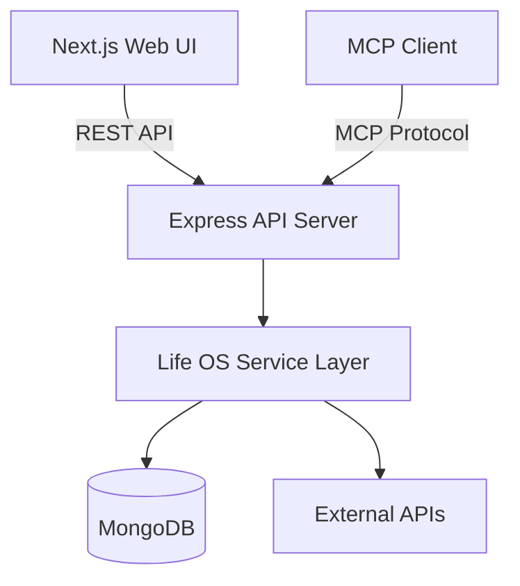
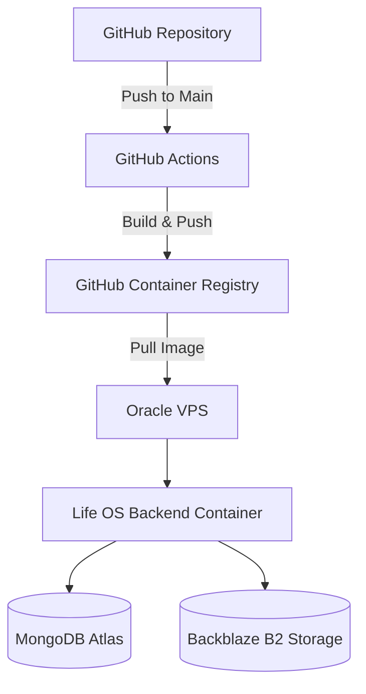

# Life OS


**Life OS** is a comprehensive, full-stack personal operating system and "second brain." It brings productivity, life tracking, knowledge management, and third-party integrations into a single, cohesive platform. 

Life OS is built to be **self-hostable**, **Dockerized**, **production-oriented**, and **MCP-enabled**, allowing seamless interoperability with modern AI agents.

---

## Why Life OS?

- **Consolidation**: Replaces dozens of fragmented tracking apps with one unified dashboard.
- **Privacy & Ownership**: Self-hostable, meaning you retain complete control over your personal data.
- **AI-Ready**: Designed from the ground up to integrate with AI agents via the Model Context Protocol (MCP), turning your life data into context for intelligent workflows.

## Core Capabilities

Life OS implements a massive suite of working modules, cleanly integrated into a single user experience.

### Productivity & Planning
- **Tasks & Goals**: Hierarchical goal tracking and daily task management.
- **Projects**: Kanban-style project tracking.
- **Habits**: Daily habit tracking with streak calculations.
- **Focus / Pomodoro**: Built-in focus timers with activity logging.
- **Weekly Review**: Guided weekly reflection and analytics.
- **Calendar**: Event management with Google Calendar sync.

### Health & Personal Logging
- **Journal**: Rich daily journaling.
- **Workouts**: Gym session and exercise tracking.
- **Diet & Meals**: Nutrition and meal logging.
- **Sleep, Body, & Water**: Daily physical metrics and hydration tracking.
- **Gratitude & Expenses**: Mindfulness logs and financial tracking.

### Knowledge & Creative Tools
- **Notes**: Rich text editor for long-form knowledge management.
- **Flashcards**: Spaced repetition studying with AI generation.
- **Whiteboard**: Canvas for visual brainstorming.
- **Reading & Bookmarks**: Reading list management and web bookmarking.
- **Captures & Wishlist**: Quick idea capture and wishlists.
- **Vault**: Secure file uploads, storage, and management.

---

## Architecture

Life OS uses a modern, decoupled client-server architecture with a shared service layer that gracefully handles both REST UI requests and MCP tool executions.



### Deployment Architecture

The backend is fully containerized and deployed automatically via GitHub Actions to an Oracle VPS, while the frontend is deployed via Vercel.



---

## MCP & AI Agent Interoperability

Life OS is natively **MCP-enabled**. It provides a client-neutral Model Context Protocol (MCP) interface designed to work directly with MCP-compatible clients such as Claude, OpenClaw, Cursor, and other compatible agents.

- **Client-Neutral**: Not hardcoded to any specific AI provider.
- **Secure by Design**: MCP requests utilize the existing authentication and service layer. All requests are strictly authorized and user-isolated.
- **Safe Execution**: MCP tools do not have direct database access; they route through the same validated business logic as the Web UI.

### Available MCP Tools
The repository currently exposes the following validated MCP tools:
- `search`: Global search across tasks, notes, journal, etc.
- `today`: Retrieve the daily dashboard context.
- `tasks` / `goals` / `projects` / `habits`: Manage productivity entities.
- `captures`: Quickly capture fleeting thoughts or links.
- `vault`: Search and retrieve metadata for stored files.

---

## Technology Stack

**Frontend**
- Next.js 15 (App Router)
- React 19 + TypeScript
- Zustand (State Management)
- Tailwind CSS + Framer Motion

**Backend**
- Node.js 22 + Express + TypeScript
- MongoDB + Mongoose

**Storage & Integrations**
- MongoDB Atlas (Primary Database)
- Backblaze B2 (Vault File Storage)
- Google APIs (OAuth, Calendar, Drive backups, Fitness)

---

## Security Architecture

Life OS implements industry-standard security practices to protect personal data:

- **Authentication**: JWT-based session handling.
- **Password Security**: Bcrypt password hashing.
- **Protection**: Express rate limiting, Helmet security headers, and strict CORS policies.
- **Data Isolation**: Strict user-level authorization checks at the service layer.
- **Private Zone**: Secondary authentication layer for sensitive Vault files.
- **MCP Security**: API token-based authentication for agent connections.

*(Note: Secrets are managed entirely via environment variables and are never committed to the repository).*

---

## Docker & Deployment

The backend is fully containerized for production environments.

- **Multi-stage Dockerfile**: Optimizes build size using Alpine Linux.
- **Security**: Runs as a non-root `lifeos` user.
- **Port**: Exposes `4000` natively.
- **Health Checks**: Provides a dedicated `/api/health` endpoint used by deployment scripts to verify successful rollouts.

### Deployment Flow
1. Code is pushed to the `main` branch.
2. GitHub Actions builds the Docker image and publishes it to GHCR (`ghcr.io`).
3. The Action connects to the target Oracle VPS via SSH, pulls the latest image, removes the old container, and starts the new one using the server's `.env` file.
4. A curl-based polling health check ensures the container is ready before reporting success.

---

## Environment Variables

### Backend (`backend/.env`)

**Required:**
- `PORT`
- `MONGODB_URI`
- `JWT_SECRET`
- `FRONTEND_URL`
- `GOOGLE_CLIENT_ID`
- `GOOGLE_CLIENT_SECRET`
- `GOOGLE_REDIRECT_URI`

**Optional / Feature-Specific:**
- `FRONTEND_URLS` (For preview environments)
- `APP_URL`
- `ENCRYPTION_KEY`
- `OPENAI_API_KEY` / `GEMINI_API_KEY` (For in-app AI features)
- `MAILJET_API_KEY` / `MAILJET_API_SECRET` / `MAILJET_FROM_EMAIL` / `MAILJET_FROM_NAME` (For email recovery)
- `B2_ENDPOINT` / `B2_KEY_ID` / `B2_APP_KEY` / `B2_BUCKET_NAME` / `B2_REGION` (For Vault uploads)

### Frontend (`frontend/.env.local`)

**Required:**
- `NEXT_PUBLIC_API_URL`

**Optional:**
- `NEXT_PUBLIC_API_URLS`

---

## Local Development Setup

1. **Prerequisites**: Node.js 18+ (Node 22 recommended), npm, and a MongoDB instance.
2. **Install**:
   ```bash
   npm install
   npm run install:all
   ```
3. **Configure Environment**:
   ```bash
   cp backend/.env.example backend/.env
   cp frontend/.env.example frontend/.env.local
   ```
   *(Fill in the necessary values)*
4. **Run Stack**:
   ```bash
   npm run dev
   ```
   *Frontend runs on `http://localhost:3000` | Backend runs on `http://localhost:8080`*

## Testing / Build

To verify the TypeScript compilation and Next.js production build:

```bash
npm run build
```

## Backup / Disaster Recovery

Life OS supports robust backup mechanisms:
- Automated MongoDB backups (if using Atlas).
- Manual JSON exports of all user data via the UI.
- Google Drive integration allowing users to push encrypted `.json` snapshots directly to their Drive.

---

## Roadmap

Future capabilities planned for Life OS:
- WebAuthn / Passkey support.
- Bi-directional sync for offline progressive web app (PWA) support.
- Extended MCP tools for calendar and whiteboard operations.

## Contributing

1. Create a feature branch.
2. Make focused, logical changes.
3. Verify your work with `npm run build`.
4. Open a PR with a clear summary.

## License

This project is open-source. Please see the [LICENSE] file for more details.